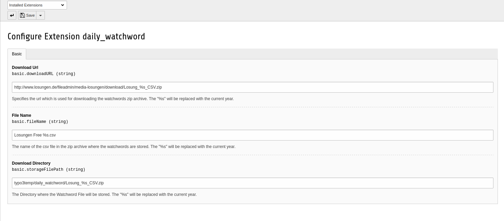

.. include:: ../Includes.txt

.. _configure:

=============
Configuration
=============

There are 3 configuration possibilities:

- **Download Url**
   This is where you can specify a custom download address for Watchword zip file. The '%s' is replaced with the current year.

- **File Name**
   Specify the file name of the csv file in the zip archive. It needs to be tab separated content and every date have to be on a new line.

- **Download Directory**
   Here you can specify the file path where the downloaded file is saved and used.

