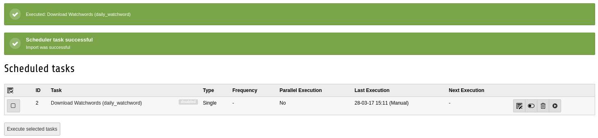

.. include:: ../Includes.txt

.. _errorMsg:

==============
Error Messages
==============

No Watchwords displayed in the Frontend
^^^^^^^^^^^^^^^^^^^^^^^^^^^^^^^^^^^^^^^

The extension could not find a watchword for today in the database and writes a error message "Date not found in database" in the 'typo3temp/var/logs/typo3.log'.

Check the the "Download Watchword" task and execute it. It will give you an error flash message.
If it shows you this:

it means that the import was successful and will probably work now.

|

If it shows this:

the current date was found in the database and no import is needed.

Import task error flash massage
^^^^^^^^^^^^^^^^^^^^^^^^^^^^^^^

+------------------------------------------------------------------------------------+-------------------------------------------------------------------+
|   Flash Message                                                                    | Description                                                       |
+====================================================================================+===================================================================+
| .. image:: ../assets/downloadFailed.png                                            |The download failed. The download path could be deprecated         |
|                                                                                    |or your custom download path is invalid. Check                     |
|                                                                                    |for updates or specify a :ref:`custom download path <configure>`.  |
|                                                                                    |If it still fails contact support.                                 |
+------------------------------------------------------------------------------------+-------------------------------------------------------------------+
| .. image:: ../assets/saveFailed.png                                                |Writing to the TYPO3 temp path failed.                             |
|                                                                                    |Check the :ref:`download directory <configure>`.                   |
|                                                                                    |                                                                   |
+------------------------------------------------------------------------------------+-------------------------------------------------------------------+
| .. image:: ../assets/zipImportFailed.png                                           |Import from zip file failed. Check :ref:`file name <configure>`.   |
+------------------------------------------------------------------------------------+-------------------------------------------------------------------+
