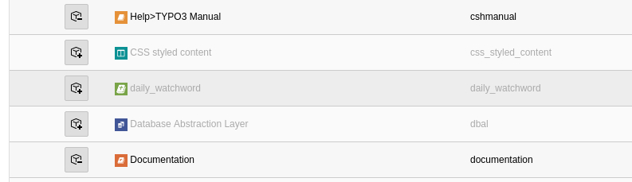
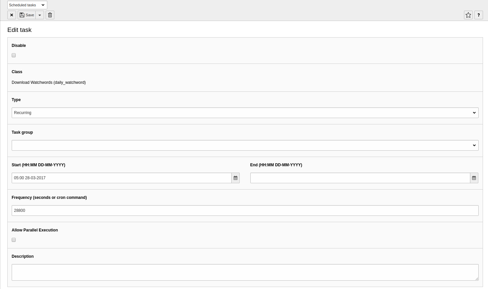

.. include:: ../Includes.txt

.. _set up:

============
Installation
============

Requirements
============

- TYPO3 8.7

Instructions
============

Simply download the extension from the TYPO3 TER extension repository in the backend.
Alternatively you can download the extension from Git, copy it into the typo3conf/ext/ Directory and activated it in the extension Manager.

Set up scheduler task
=====================

Set up scheduler task "Download Watchwords". The extension downloads the watchwords for the for the whole current year.
You can set it up automatically recurring 1-3 times a day. It downloads the new watchwords at on the first day of the new year.
Alternatively you can activate it manually once a year.
Every time it runs, it checks if there is a watchword for today in the database and if not, its starts the import process.

|

